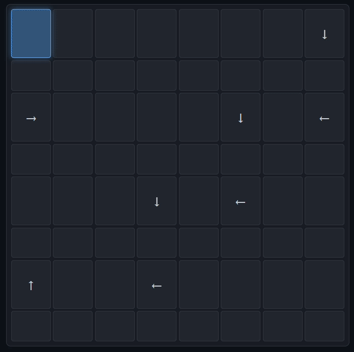

# TopoCore

> A spatial execution architecture where computation emerges from movement through symbolic space.

## ⚙️ Implementation Stack


## What is TopoCore?

TopoCore is an experimental hardware architecture inspired by two-dimensional programming languages such as Befunge.

Unlike traditional CPUs that execute instructions linearly using a single program counter, TopoCore executes programs arranged in a 2D grid using:

- X position
- Y position
- Direction of traversal

Execution is no longer a straight line.  
Programs are treated as symbolic spaces through which computation moves.

<p align="center">
  
</p>

<p align="center">
    </b> Spatial Execution
</p>

> See spatial execution in action - place direction glyphs on a grid
> and watch the cursor travel through space constrained by locality.
> [Try the demo](Spatial-Execution-Visualization.html)

## The Core Argument

Normal CPUs encode logical flow through address order.
Geometry of memory is incidental. Two consecutive addresses
can be physically distant and execution is unaffected.

TopoCore encodes logical flow through spatial continuity.
Geometry is constitutive. Position determines execution.

This makes TopoCore programs `semasiographic` - meaning lives
in spatial arrangement, not in arbitrary symbolic addressing.

> The semasiographic argument and the cosmetic topology criticism are addressed in [Spatial Semantics](Spatial%20Semantics).

## Why?

Modern processors follow a fundamentally linear execution model:

```text
PC -> fetch -> decode -> execute -> PC + 1
```

TopoCore explores an alternative model where computation depends on spatial traversal itself:

```text
(X, Y, Direction) -> fetch -> interpret -> move
```

This changes the architecture fundamentally:

- the program counter becomes spatial,
- instruction fetch becomes 2D,
- control flow becomes directional,
- and execution depends on geometry and movement through symbolic space.

The project explores:

- non-linear execution,
- spatial computation,
- symbolic systems,
- and unconventional hardware architecture.

## Goals

- Learn minimal computation through Brainfuck
- Study spatial execution through Befunge
- Build a software interpreter
- Implement a SystemVerilog-based execution engine
- Design a direction-aware control architecture
- Explore symbolic and spatial computation systems

> Teaching a machine to read meaning from space.

## Status

- [x] Brainfuck - complete language study, programs, hardware mapping
- [x] Befunge-93 - complete language study, programs, hardware mapping
- [ ] Theory - spatial semantics, semiotics
- [ ] Interpreters - Python and C
- [ ] Glyph system design
- [ ] Hardware architecture
- [ ] SystemVerilog implementation
- [ ] FPGA synthesis and visualization

## 📜License
- Source code and HDL files are licensed under the MIT License.
- Documentation, diagrams, images, and PDFs are licensed under Creative Commons Attribution 4.0 (CC BY 4.0).
