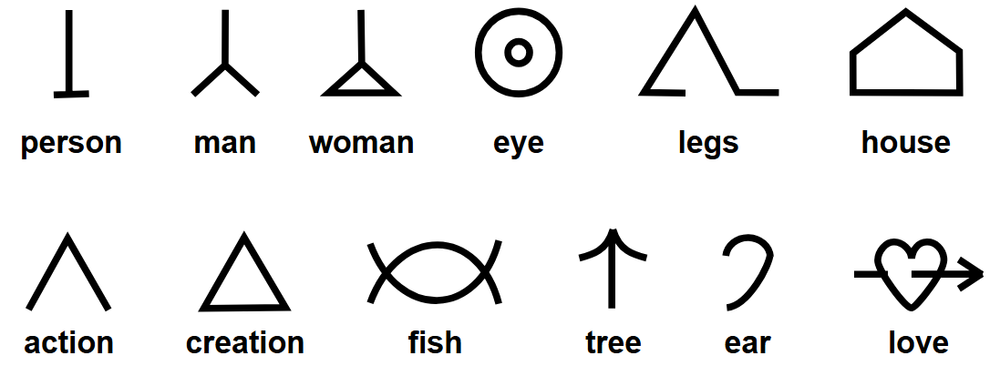
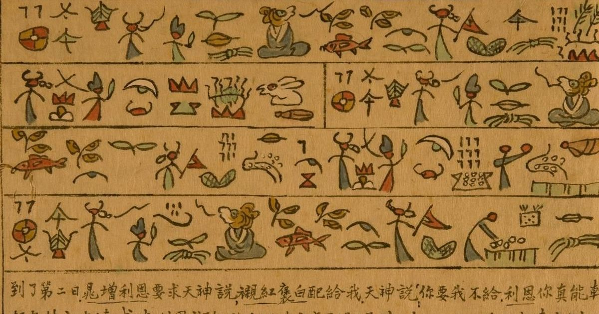
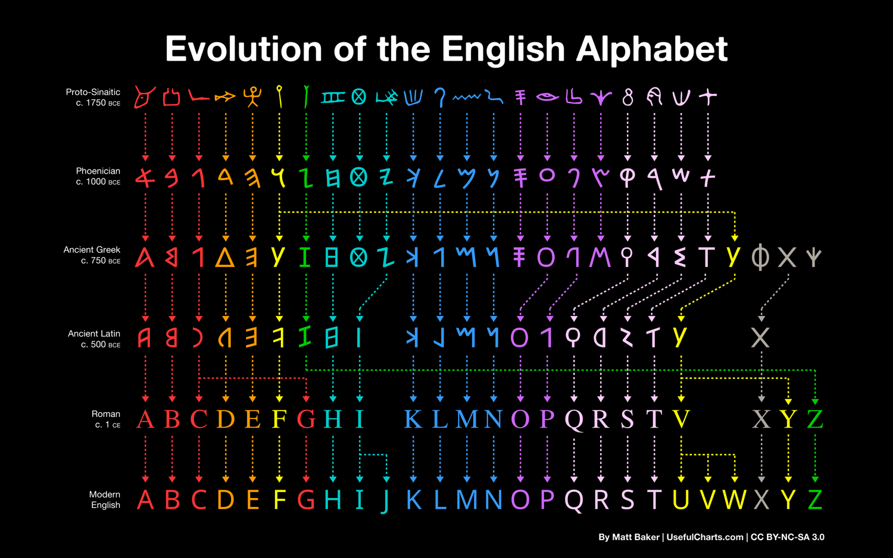

# Sign Classification - Peirce's Three Types

## Peirce's Three Sign Types

**Icon** - directly resembles what it wants to convey.
Example: Image of fire. You recognize fire because the image looks like fire.

**Index** - represents something related to or caused by what it wants to convey.
Example: Smoke represents fire. Prometheus represents fire through causal and
mythological connection. The sign exists because of a real relationship with
what it points to.

**Symbol** - agreed upon by society to mean something real. No natural connection
between the sign and its meaning. Pure convention.
Example: The word fire. Nothing about those four letters resembles or causally
connects to combustion. English speakers agreed on that mapping.

## Most Real Signs Are Hybrids

Pure icons, pure indices, and pure symbols are theoretical extremes.
In reality causality, resemblance, and convention interact - most signs
mix all three types in different proportions.

## Classification of Befunge Direction Commands

### Iconic Commands

`>` `<` `^` `v` are iconic. They directly resemble what they convey - direction.
You do not need a convention to understand that `>` points right or `^` points up.
The shape carries the meaning naturally.

### Hybrid Commands

`|` and `_` are hybrid signs.

**Iconic dimension** - `|` is a vertical line representing vertical movement.
`_` is a horizontal line representing horizontal movement. The shape partially
conveys the axis of direction without any convention required.

**Symbolic dimension** - the conditional logic is not encoded in the shape at all.
The zero check, the stack pop, the branching decision, none of that is visible
in a vertical or horizontal line. That part is pure convention.

**Indexical dimension** - the outcome of the branch is causally related to the
stack value. The direction the cursor takes is a consequence of the condition.
So the resulting direction indexes the stack state that caused it.

## Design Implication For Topocore

The Befunge instruction set mixes iconic and symbolic signs arbitrarily - ASCII
characters chosen for convenience, not for meaning. 

> The goal: a program that is partially readable from shape alone.

# Saussure - Signifier, Signified, and Arbitrariness

## The Core Idea

Peirce asked - what is the relationship between a sign and the world?
Saussure asked - what is a sign made of internally?

Saussure's answer was `every sign has two parts.`

## Signifier and Signified

**Signifier** - the form of the sign. The sound, the shape, the written mark.
Anything that carries or triggers meaning. The physical or perceptual side.

Example: The written marks `d-o-g` or the spoken sound `dawg`.

**Signified** - the concept the signifier points to. The mental idea or image
it triggers in the mind of the person reading or hearing it.

Example: The mental concept of a four legged animal that barks.

Together they form a sign. You cannot have one without the other.
A signifier with no signified is just noise. A signified with no signifier
is just a thought with no way to communicate it.

## Arbitrariness

Saussure's most important claim - the relationship between signifier and
signified is arbitrary.

Arbitrary means there is no natural or necessary connection between the
form of a sign and the concept it represents. The connection exists only
because a community of people agreed on it.

Example: The word `fire`.
Nothing about the sounds `f-i-r-e` resembles combustion. Nothing about
those four letters looks like flames. English speakers agreed that sound
means that thing. French speakers agreed on `feu`. Hindi speakers on `aag`.
Same signified, completely different signifiers. All arbitrary.

This is why you can learn any language - the mappings are all conventions

## Motivated Signs - Where Arbitrariness Breaks Down

Saussure acknowledged exceptions. Some signs have a natural connection
between signifier and signified. He called these motivated signs.

**Onomatopoeia** - words that sound like what they mean.
Example: `buzz`, `crash`, `hiss`. The sound of the word resembles the sound
of the thing. Not fully arbitrary.

**Visual motivated signs** - marks that look like what they mean.
Example: `>` meaning rightward direction. The shape points right naturally.
You do not need a convention to understand it. The resemblance is inherent.
Compare to `R` meaning right - that is fully arbitrary. Nothing about the
letter R points rightward without a prior agreement.

More examples of motivated visual signs:
- `→` meaning direction
- A map resembling the territory it represents
- A skull meaning danger or death
- `^` meaning upward

Peirce called motivated signs **icons**. Saussure called them motivated.
Same observation, different vocabulary.

## Peirce vs Saussure 

| | Peirce | Saussure |
|---|---|---|
| Question asked | How does a sign relate to the world? | What is a sign made of internally? |
| Focus | Classification of sign types | Structure of the sign itself |
| Key categories | Icon, Index, Symbol | Signifier, Signified |
| On arbitrariness | Icons are non-arbitrary, symbols are arbitrary | Most signs are arbitrary by nature |
| Scope | All signs - pictures, words, code | Primarily natural language |

They are not contradicting each other. They are looking at the same thing
from different angles. Peirce gives us a taxonomy of signs. Saussure gives
us the internal anatomy of a sign.

For Topocore - Peirce is more useful because we are designing a sign system
from scratch and need to make deliberate choices about how motivated or
arbitrary each sign is.

## Glyphs

A glyph is simply a written mark or symbol - any visual form that carries
meaning in a writing system.

Examples:
- The letter `A` is a glyph
- The digit `3` is a glyph
- The arrow `→` is a glyph
- The `+` sign is a glyph
- A Chinese character is a glyph
- A Brainfuck command like `>` is a glyph

Every writing system is a collection of glyphs with agreed meanings.
Some glyphs are iconic, their shape carries meaning naturally.
Some glyphs are symbolic, their meaning is purely conventional.
Most are hybrid.

## The Motivation Spectrum

```
Signs exist on a spectrum from fully arbitrary to fully iconic:
Fully arbitrary ←————————————————————→ Fully iconic
R                          |                    >
means right         means vertical      means right
by convention       movement partly     by resemblance
                      by shape
```

The further right on the spectrum the more readable without a reference.
The further left the more memorization required.

## Design Implication For TopoCore

Befunge's current instruction set uses ASCII characters chosen for
convenience - mostly arbitrary symbols with occasional motivated choices
like `>` `<` `^` `v`.

TopoCore's glyph system will be designed deliberately.

The goal: maximize iconic encoding. Every glyph should carry as much
meaning as possible through its shape alone, without relying on arbitrary
convention. A person reading a Topocore program should be able to infer
what many instructions do from the shape of the glyphs, without a
reference table.

This is not just aesthetic. It connects directly to the semasiographic
argument - if meaning lives in spatial arrangement and in the shapes of
the marks themselves, then the program becomes more self-explanatory.
The layout and the glyphs together carry the full meaning.

# Semasiography

## What Is Semasiography

Semasiography is writing that encodes meaning directly in signs bypassing
spoken language entirely. The marks connect directly to concepts in the mind,
not to intermediate sounds. A semasiographic system is readable regardless
of native spoken language because no phonetic encoding is involved.

Contrast with phonography - writing that encodes sounds of a spoken language.
English, Hindi, Arabic are phonographic. You can read them aloud without
understanding them because the marks encode sounds, not meanings.

## Mathematical Notation 
∫₀^∞ e^(-x²) dx = √π / 2

A mathematician in Tokyo, Cairo, São Paulo, and Delhi read this identically.
No translation. No ambiguity. Perfect meaning transfer across language boundaries.

Every mark connects directly to a mathematical concept not to a sound.
`∫` does not sound like anything. `√` encodes no phoneme. They are pure
concept-marks. This is semasiography at its most powerful.

Limitation is mathematical notation only works for mathematical concepts.
Its semasiographic power is deep but narrow.

## Blissymbols - Attempted Universal Semasiography

Charles Bliss was an Austrian Jewish engineer who survived the Holocaust.
Convinced that human conflict was partly caused by language barriers, he
spent years designing a universal writing system readable by anyone regardless
of native language.

The system assigns signs to primitive human concepts. Signs combine logically
and visually to build complex meaning.



Combinations follow visual and logical rules not phonetic ones. Meaning
is built compositionally from simpler marks.

Blissymbols is used today for augmentative communication with people who
cannot speak, it remains one of the most complete semasiographic systems
ever designed for general human communication.

Design lesson for Topocore - primitive marks for basic concepts, logical
and iconic combination rules for complex concepts.

## Dongba Script - The Last Living Pictographic System

The Naxi people of Yunnan province in southwestern China maintained a
writing system for over a thousand years used by their priests, Dongba -
for religious rituals and ceremonies.

Dongba script is historically significant because it is the last living
pictographic writing system actively used by human beings. Every other
pictographic system died or evolved into abstraction thousands of years ago.



Concepts are drawn as pictures. A man walking is drawn as a figure in motion.
Fire is drawn as flames. Over centuries some marks became more abstract while
retaining traces of their original pictographic form making Dongba a living
record of the transition from fully iconic to partially abstract writing.

## The Universal Evolution Pattern

```
Fully iconic picture
          ↓
Simplified iconic mark
          ↓
Partially abstract glyph
          ↓
Fully arbitrary symbol
```

English letters were pictures once. The letter A was originally an ox head -
aleph in Phoenician, rotated and abstracted over millennia into A.
Chinese characters show the same evolution.
Egyptian hieroglyphics began as pictures and became increasingly abstract.



Writing systems drift toward abstraction because abstraction is faster to
write and easier to standardize. But abstraction costs iconic readability.

## Reading Behavior vs System Design

An important distinction raised during study:

After years of exposure to a phonographic system skilled readers develop
direct access, seeing a word and knowing its meaning instantly without
subvocalizing sounds. The phonological route becomes optional.

Brain imaging confirms this. Expert readers activate the visual word form
area directly  bypassing phonological processing for familiar words.

So a phonographic system can functionally behave like a semasiographic one
for the skilled reader. But the system design remains phonographic. If you
encounter an unfamiliar word you immediately try to sound it out, the
phonographic scaffolding reveals itself when direct access fails.

Semasiographic systems have no such fallback. Meaning is the only route.

Implication for Topocore - iconic glyphs serve both the newcomer who reads
meaning from shape and the expert who has developed direct access. Arbitrary
symbols only serve the expert. Iconic design is strictly better.

## Where Befunge Sits

Befunge is proto-semasiographic.

It uses spatial arrangement as its primary semantic substrate - execution
path is determined by position and direction, not by arbitrary address order.
The program bypasses spoken language entirely. You need not know any human
language to trace a Befunge program.

But Befunge inherits symbolic baggage from ASCII. The digit 3 pushes 3
because we learned that from our number system. The + means addition because
we learned that from mathematics. These are not iconic by Befunge's own
design they are inherited conventions.

Befunge sits between semasiography and phonography, leaning toward
semasiography but not fully achieving it.

## Where Topocore Aims

Topocore completes the semasiographic move that Befunge begins.

By replacing inherited ASCII symbols with purpose-designed iconic glyphs
where shape encodes meaning directly. Topocore makes the instruction set
itself semasiographic, not just the spatial arrangement.

The precise statement:

> Befunge is proto-semasiographic as it uses spatial arrangement as its
> primary semantic substrate but inherits symbolic baggage from ASCII.
> Topocore completes the semasiographic move by replacing inherited symbols
> with purpose-designed iconic glyphs.

Two layers of semasiography:
1. Spatial arrangement determines execution - inherited from Befunge
2. Glyph shapes encode meaning iconically - Topocore's original contribution

Together they make Topocore the most fully semasiographic computational
system designed at the hardware level.

## Visual Analysis - Three Reference Systems

### The Alphabet Evolution - Iconic to Symbolic Drift

The evolution of the English alphabet from Proto-Sinaitic c.1750 BCE to
Modern English shows the universal trajectory of writing systems
from fully iconic to fully symbolic over approximately 3000 years.

Proto-Sinaitic marks were pictures. A fish looked like a fish. A hand
looked like a hand. The signifier resembled the signified directly.

Modern English letters retain almost no iconic trace. The letter D
descends from a fish - remove the tail, fins, and mouth and the curve
remains. The letter K descends from a mark resembling a boiling vessel
or flame, the diagonal strokes remain but the iconic origin is
unrecognizable without the evolutionary chart.

This drift happened not by design but by pressure:
- Writing speed demanded simpler strokes
- Standardization across regions flattened regional variations
- Tool constraints - stylus, pen, chisel pushed toward geometrically
  simple forms

Nobody decided to make D look less like a fish. It drifted.

### Blissymbols - Minimal Iconicity

Blissymbols uses reduced iconic forms. Each primitive retains the
minimum visual information needed to trigger the correct concept -
nothing more.

The eye symbol is two concentric circles. A real eye has exactly this
structure - iris and pupil as concentric circles. Every other feature
of the eye - eyelashes, eyelids, color is stripped away. Only the
most visually distinctive and uniquely identifying feature remains.

The fish symbol is an ellipse with crossing lines suggesting fins.
Not a detailed drawing of a fish, just the essential shape that
uniquely identifies fish as distinct from all other concepts.

This design principle is called **minimal iconicity**:

> Keep only the visual feature that uniquely identifies the concept.
> Remove everything else.

Why this works:
- Fast to write and render
- Unambiguous - the essential feature discriminates from other concepts
- Still iconic enough to be readable without a reference table
- Standardizable - the reduced form is consistent across writers

**Implication for Topocore** - minimal iconicity is the correct design
target for glyphs. Not full pictographic representation like Dongba.
Not arbitrary abstraction like ASCII. The minimum iconic form that
uniquely identifies each opcode.

### Dongba Script - Full Pictographic Representation

Dongba script takes the opposite approach to Blissymbols. Rather than
abstracting to a minimal form, Dongba tries to represent the signified
as completely as possible - full figures, postures, colors, spatial
relationships between elements.

A person is drawn as a complete human figure with posture conveying
meaning. Animals are drawn with identifying features intact. Scenes
are composed pictographically with spatial arrangement carrying
narrative meaning.

Comparison:

| Property | Dongba | Blissymbols |
|----------|--------|-------------|
| Iconic fidelity | Very high | Moderate |
| Writing speed | Slow | Fast |
| Ambiguity | Low | Low |
| Learnability | High - looks exactly like things | High - looks like reduced things |
| Standardization | Difficult - full figures vary | Easier - reduced forms are consistent |

Dongba is historically significant not as a design model but as
evidence as it shows that fully pictographic systems can survive
for over a thousand years and remain readable. Iconicity is not
inherently unstable. Drift toward abstraction is a pressure, not
an inevitability.

**Implication for TopoCore** - Dongba proves iconic systems are
viable long term. Blissymbols shows how to make them practical.
Topocore combines both lessons - viable iconic glyphs designed
at minimal iconicity.

### The Core Design Rule Derived From All Three

Looking across the alphabet evolution, Blissymbols, and Dongba,
a single design principle emerges for Topocore's glyph system:

> Keep only the visual feature that uniquely identifies the concept.
> Remove everything else.
> Design deliberately - do not let the system drift toward arbitrary abstraction.
> Resist the entropy that turned fish into D.

# Non-Linear Orthography

## What Is Orthography

Orthography refers to the conventions of a writing system - what
direction to write, rules for spacing, capitalization, line breaks,
and how marks combine. Not the marks themselves but the rules
governing their arrangement.

## Linear vs Non-Linear

**Linear orthography** - writing follows a single sequential direction.
One mark follows another along a line. Position encodes sequence only,
what comes before and after. Nothing more.

Examples:
- English - left to right, top to bottom
- Arabic - right to left
- Traditional Chinese - top to bottom

Different directions. All linear. One mark always follows another
along a single axis.

**Non-linear orthography** - marks are spread across space. Meaning
is inferred from spatial arrangement rather than from a sequential
reading path. Position encodes relationships - above, below, connected
to, inside, outside - not just sequence.

## Two Types Of 2D Writing Systems

### Type 1 - Semantic Axes

Each dimension independently encodes one thing. Meaning is read by
interpreting each axis separately.

Example - sheet music:
- Horizontal axis encodes time
- Vertical axis encodes pitch
- Both axes carry independent deterministic meaning

Example - mathematical superscripts:
- Horizontal position encodes sequence
- Vertical position encodes exponent relationship
- Position relative to base symbol encodes operation type

### Type 2 - Topological Space

Dimensions define a traversable space. Neither axis independently
encodes a fixed meaning. Instead both dimensions together define
possible paths through the space. Meaning comes from which path
is taken not from the axes themselves.

Example - flowcharts:
- No axis independently means anything
- Meaning comes from following arrows through the diagram

Example - circuit diagrams:
- Components placed spatially
- Meaning comes from tracing connections between components

Example - Befunge and TopoCore:
- Neither horizontal nor vertical axis encodes one fixed thing
- Both dimensions define the topological space of possible execution
- Meaning comes from which path the cursor takes through that space

## Historical Examples

### Boustrophedon

Ancient Greek writing that alternates direction every line
left to right on line 1, right to left on line 2, and so on.
Like an ox plowing a field back and forth.

Note - boustrophedon is still linear. It alternates direction
but each line is still a sequential path. It breaks the assumption
of fixed direction but not the assumption of linearity.

### Aztec Codices

Pre-Columbian manuscripts where reading order follows a winding
path through the page indicated by footprints drawn between scenes.
The reader follows the footprints not a fixed left-to-right order.

The reading path is encoded in the document itself. This is
explicitly topological, the path is drawn into the manuscript.
Closer to Type 2 than Type 1.

Footprints encode narrative flow with directional independence,
they can curve, loop, cross, go anywhere on the page. The path
is flexible and interpretive.

### Chinese Seal Script and Oracle Bone Script

Ancient Chinese writing where characters could be written in
multiple orientations. Reading order was determined by context
and spatial arrangement rather than fixed convention.

Context-dependent reading order maps naturally to topological
space, the reader determines the path rather than following
a fixed one. Similar in principle to TopoCore's cursor following
direction glyphs through the grid.

## Aztec Footprints vs Befunge Direction Glyphs

Both guide a reader through 2D space. Both are semasiographic.
But they differ in three important ways.

| Property | Aztec Footprints | Befunge Direction Glyphs |
|----------|-----------------|--------------------------|
| Sign type | Indexical - feet cause footprints | Iconic - shape resembles direction |
| Iconicity | High - literally depicts feet in motion | Minimal - just enough to suggest direction |
| Path constraint | None - can go anywhere narratively | Strict - constrained by grid and locality |
| Reader | Human - tolerates interpretive latitude | Machine - requires zero ambiguity |
| Encodes | Narrative flow | Computational flow |

Aztec footprints tell a story - flexible and interpretive.
Direction glyphs encode computation - deterministic and unambiguous.

## The Machine Reading Constraint

Computation is a step by step algorithmic process. Every instruction
must have exactly one unambiguous meaning. A machine cannot infer
intent or tolerate interpretive latitude.

This imposes a hard constraint on TopoCore's glyph system:

> Direction glyphs must be unambiguous, minimally iconic, and
> orientation-sensitive. A glyph pointing right must be visually
> distinct from a glyph pointing left at a glance with no
> interpretive flexibility.

Furthermore TopoCore glyphs must be:
- Context independent - same glyph means same operation everywhere
- Orientation discriminable - rotations of the same base shape
  must be visually distinct
- Minimally complex - simple enough to render in hardware and
  decode unambiguously at the circuit level

Human narrative reading tolerates ambiguity. Machine execution
cannot. That constraint is the primary driver of TopoCore's
glyph design rules.

## Why TopoCore Is Non-Linear Orthography

TopoCore programs are written on a 2D grid. No fixed reading
direction exists. The cursor path through the grid is determined
by direction glyphs placed spatially. A program with a loop has
a visible cycle in the grid. A program with a branch has a visible
fork. The spatial layout directly encodes the control flow structure.

This satisfies the definition of non-linear orthography precisely -
meaning is inferred from spatial arrangement, not from a sequential
reading path along a single axis.
